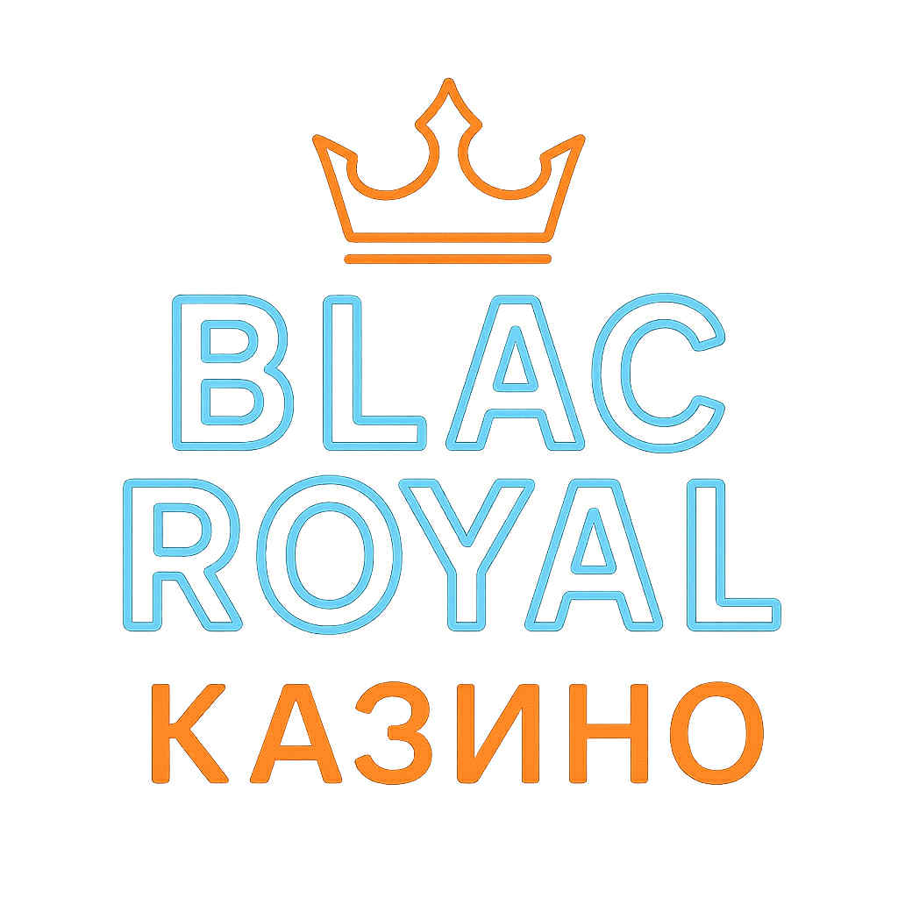

# Internetowe Kasyno

> **Motto projektu:** *„Dzisiaj w Betlejem, jutro Bentleyem”* 🚗💨  
> Platforma rozrywkowa online oferująca proste gry losowe i zręcznościowe dla pełnoletnich użytkowników.  
> Każdy znajdzie coś dla siebie — od klasycznej ruletki po dynamiczny coinflip!

---

  

## Opis projektu

**Internetowe Kasyno** to aplikacja webowa umożliwiająca użytkownikom grę w różne mini-gry oparte na losowości i zręczności.  
Celem projektu jest stworzenie bezpiecznego, intuicyjnego i atrakcyjnego środowiska do rozgrywki online z zachowaniem zasad fair play.

Projekt ma charakter **edukacyjny i demonstracyjny** – nie służy do prawdziwego hazardu.

---

## Zakres MVP (Minimum Viable Product)

### Rejestracja i logowanie
- Tworzenie nowego konta użytkownika  
- Logowanie z wykorzystaniem hasła (opcjonalnie 2FA)  
- Weryfikacja pełnoletności

### Zarządzanie kontem użytkownika
- Edycja danych profilu  
- Zmiana hasła  
- Podgląd historii gier i transakcji  

### Portfel i saldo użytkownika
- Wirtualna waluta (MufaCOIN)  
- Doładowanie i wypłata środków (symulacja)  
- Historia transakcji  

### Rozgrywka – proste gry
Dostępne mini-gry w wersji MVP:
- 🎲 **Ruletka** – klasyczna europejska ruletka z jednym zerem  
- 💣 **Saper** – gra logiczno-losowa z możliwością wygrania punktów  
- 🎰 **Slot** – automat z symbolami (trzy bębny, system nagród)  
- 🎯 **Suwak** – gra refleksu i precyzji  
- 🪙 **Coinflip** – rzut monetą: orzeł czy reszka?

### Bezpieczeństwo
- Szyfrowanie haseł
- Walidacja danych użytkownika  
- Sesje z tokenami JWT  

### System rankingowy
- Tabela najlepszych graczy tygodnia  
- Punkty rankingowe zależne od aktywności i wygranych  
- Odznaki i poziomy prestiżu  

---

## Technologia (przykładowy stack)

| Warstwa | Technologia |
|----------|--------------|
| Frontend | React |
| Backend  | Node.js (Express) |
| Baza danych | MongoDB / PostgreSQL |
| Autoryzacja  |
| Style | CSS |
| Hosting |

---

For migrations use: npx prisma db push

